# PR7

## Завдання 1
### В цьому завданні треба було у коді викликати команду rwho та передати її значення у more. Ось код:
```
#include <stdio.h>
#include <stdlib.h>

int main(int argc, char const *argv[])
{
    FILE *rhwo_output;
    char buff[256];

    // write rwho command and read it`s output (with sudo)
    rhwo_output = popen("sudo rwho", "r");
    if(rhwo_output == NULL){
        perror("popen rwho error");
        return 1;
    }

    // write more command to write data into
    FILE *more_input = popen("more", "w");
    if(more_input == NULL){
        perror("popen more error");
        pclose(rhwo_output);
        return 1;
    }

    // read lines from rwho output and write it to more
    while(fgets(buff, sizeof(buff), rhwo_output) != NULL){
        fputs(buff, more_input);
    }

    pclose(rhwo_output);
    pclose(more_input);
    return 0;
}
```
### І консольний результат:
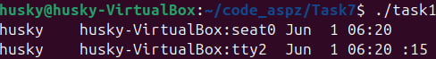
### Аналогічно до цієї команди:
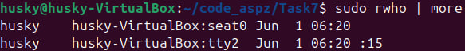

## Завдання 2
### Тут, треба було не використовуючи виклик команд ls -l створити програму, яка вручну би виводила параметри всіх файлів зі своєї директорії (назва, рівень достпупу, користувач і т.д.)
### Я користувався бібліотеками, які працюють з директоріями та надають системну інформацію про файли.
```
#include <stdio.h>
#include <stdlib.h>
#include <dirent.h>     // for DIR, struct dirent, opendir, readdir, closedir
#include <sys/stat.h>   // for struct stat, stat()
#include <sys/types.h>  // for mode_t
#include <unistd.h>     // for misc system calls
#include <pwd.h>        // for getpwuid() – to get user name
#include <grp.h>        // for getgrgid() – to get group name
#include <time.h>       // for time formatting
#include <string.h>     // for string functions

// to get file type as a string
const char* get_file_type(mode_t mode) {
    if (S_ISREG(mode)) return "Regular";
    else if (S_ISDIR(mode)) return "Directory";
    else if (S_ISLNK(mode)) return "Symlink";
    else if (S_ISCHR(mode)) return "Char Device";
    else if (S_ISBLK(mode)) return "Block Device";
    else if (S_ISFIFO(mode)) return "FIFO";
    else if (S_ISSOCK(mode)) return "Socket";
    else return "Unknown";
}

// to get permission string (like -rwxrwxr-x, etc.)
void get_permissions(mode_t mode, char *perm) {
    strcpy(perm, "----------");
    if (S_ISDIR(mode)) perm[0] = 'd';
    if (S_ISLNK(mode)) perm[0] = 'l';
    if (mode & S_IRUSR) perm[1] = 'r';
    if (mode & S_IWUSR) perm[2] = 'w';
    if (mode & S_IXUSR) perm[3] = 'x';
    if (mode & S_IRGRP) perm[4] = 'r';
    if (mode & S_IWGRP) perm[5] = 'w';
    if (mode & S_IXGRP) perm[6] = 'x';
    if (mode & S_IROTH) perm[7] = 'r';
    if (mode & S_IWOTH) perm[8] = 'w';
    if (mode & S_IXOTH) perm[9] = 'x';
}

int main() {
    DIR *dir;
    struct dirent *entry;
    struct stat fileStat;
    char permissions[11];

    dir = opendir("."); // open current directory
    if (dir == NULL) {
        perror("opendir");
        return 1;
    }

    // create comfortable header
    printf("%-25s %-10s %-10s %-8s %-8s %-10s %-20s %-20s\n", 
           "Name", "Type", "Size", "User", "Group", "Perm", "Access Time", "Modify Time");

    // loop that iterates every and each file in directory
    while ((entry = readdir(dir)) != NULL) {
        if (stat(entry->d_name, &fileStat) < 0) { // get file info
            perror("stat");
            continue;
        }

        get_permissions(fileStat.st_mode, permissions);

        struct passwd *pw = getpwuid(fileStat.st_uid);
        struct group  *gr = getgrgid(fileStat.st_gid);

        // format time
        char acc_time[20], mod_time[20];
        strftime(acc_time, sizeof(acc_time), "%Y-%m-%d %H:%M", localtime(&fileStat.st_atime));
        strftime(mod_time, sizeof(mod_time), "%Y-%m-%d %H:%M", localtime(&fileStat.st_mtime));

        // print all info
        printf("%-25s %-10s %-10ld %-8s %-8s %-10s %-20s %-20s\n",
               entry->d_name,
               get_file_type(fileStat.st_mode),
               fileStat.st_size,
               pw ? pw->pw_name : "unknown",
               gr ? gr->gr_name : "unknown",
               permissions,
               acc_time,
               mod_time);
    }

    closedir(dir);
    return 0;
}
```
### Всі мої файли:
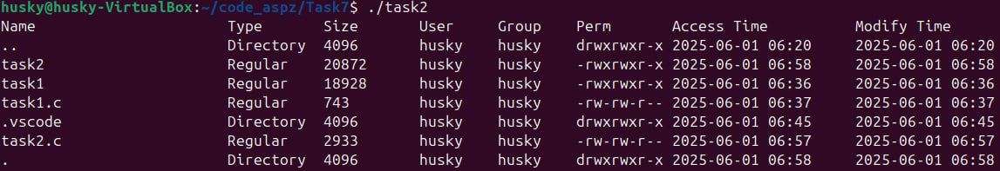

## Завдання 3
### Створити програму, яка буде читати вміст файлу, переданого у якості аргумента, як і слова. Завдання буде вивести рядки з файлу, у яких присутнє це саме слово. Ось не супер складний код:
```
#include <stdio.h>
#include <string.h>

#define MAX_LINE 120

int main(int argc, char const *argv[])
{
    if(argc != 3){
        printf("Usage: %s <word> <file>\n", argv[0]);
        return 1;
    }

    const char *word = argv[1];
    const char *filename = argv[2];
    
    FILE *f = fopen(filename, "r");
    if(f == NULL){
        perror("Incorrect filename");
        return 1;
    }

    char line[MAX_LINE];
    while (fgets(line, MAX_LINE, f))
    {
        if(strstr(line, word)){
            printf("%s", line);
        }
    }
    
    fclose(f);
    return 0;
}
```
### Ось вміст файлу:
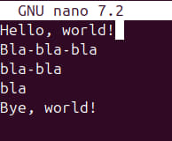
### Ось вивід знайдених сторінок:
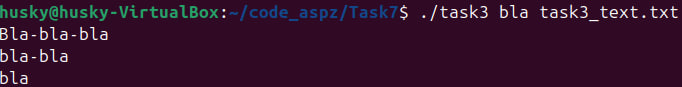
### А соь перевірка всіх можливих кейсів:
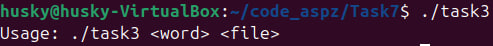
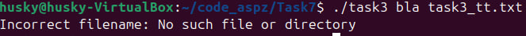
## Завдання 4
### Завданням було створити програму, яка зчитувала би файли, передані як аргументи і очікувала на ввід від користувача enter кожні 20 рядків для того, аби продовжити вивід (аналог more в Unix)
```
#include <stdio.h>
#include <errno.h>
#include <string.h>

#define MAX_LINE_PER_PAGE 20
#define MAX_LINE 200

int main(int argc, char const *argv[])
{
    if(argc < 2){
        printf("Usage: %s <file> <file> <file>...\n", argv[0]);
        return 1;
    }

    FILE *f;
    char buff[MAX_LINE]; 
    int line_count = 0;

    for(int i = 1; i < argc; i++){
        printf("\n--- file %s show: ---\n", argv[i]);
        f = fopen(argv[i], "r");
        if(f == NULL){
            fprintf(stderr, "Open %s file error: %s\n", argv[i], strerror(errno));
            return 1;
        }

        while(fgets(buff, MAX_LINE, f)){
            printf("%s", buff);
            line_count++;

            if(line_count >= MAX_LINE_PER_PAGE){
                printf("--- Enter to continue ---\n");
                while(getchar() != '\n');
                line_count = 0;
            }
        }
        printf("\n");
    }

    fclose(f);
    return 0;
}
```
### Нормальний вивід файлу:
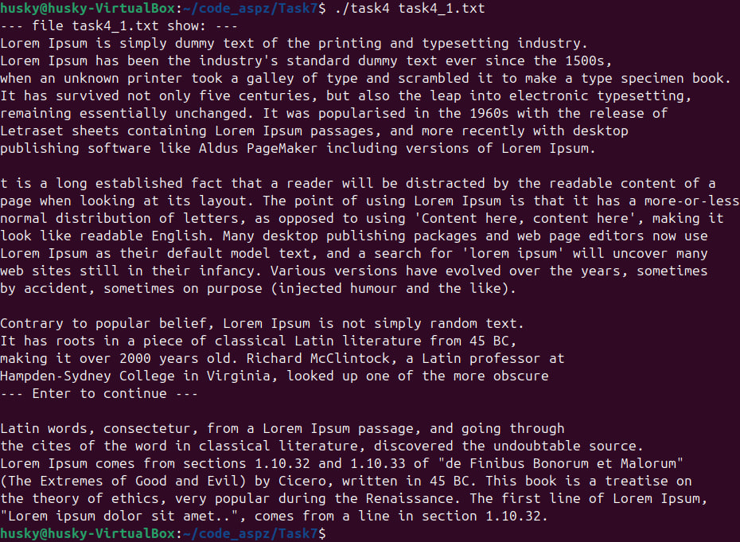
### Перевірка можливих кейсів:
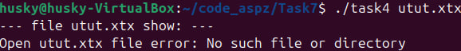
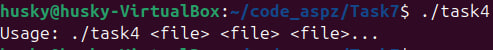
## Завдання 5
### Завдання було створити програму, яка показувала всі файли директорій, як основної, де знаходиться виконавчий файл, так і всіх дочірніх. Використаємо бібліотеки для роботи з директоріями та властивостями файлів
```
#include <stdio.h>
#include <stdlib.h>
#include <dirent.h>
#include <string.h>
#include <sys/stat.h>
#include <unistd.h>

#define PATH_MAX 4096

void files_list(const char *path){
    struct dirent *entry; //represent directory entry
    DIR *dir = opendir(path);

    if(dir == NULL){ // check if we can open path
        perror("path");
        return;
    }

    while((entry = readdir(dir)) != NULL){
        // skip '.' and '..'
        if(strcmp(entry->d_name, ".") == 0 || strcmp(entry->d_name, "..") == 0)
            continue;

        char fullpath[PATH_MAX];
        snprintf(fullpath, sizeof(fullpath), "%s/%s", path, entry->d_name); // to rewrite text to fullpath

        struct stat statbuf; // represent file`s properties
        if(stat(fullpath, &statbuf) == -1){ // check for error to read file info
            perror(fullpath);
            continue;
        }

        if(S_ISDIR(statbuf.st_mode)){ // check if it is directory or file
            printf("[DIR] %s\n", fullpath);
            files_list(fullpath); // call recursion to show subdirectory and continue father`s while()
        }else{
            printf("[FILE] %s\n", fullpath);
        }
    }

    closedir(dir);
}

int main(int argc, char const *argv[])
{
    files_list(".");
    return 0;
}
```
### Ось, що отримуємо на виході:
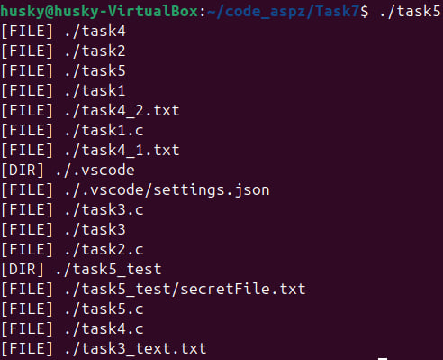
## Завдання 6
### Для цього завдання модифікуємо код з попереднього, виставивиши ігнорування файлів та фільтрування всіх дочірніх директорій у алфавітному порядку
```
#include <stdio.h>
#include <stdlib.h>
#include <dirent.h>
#include <string.h>
#include <sys/stat.h>
#include <unistd.h>
#include <limits.h>

#define MAX_ENTRIES 1024 // Adjust as needed
#define PATH_MAX 4096    // Ensure compatibility

int cmpstrings(const void *a, const void *b) {
    const char **sa = (const char **)a;
    const char **sb = (const char **)b;
    return strcmp(*sa, *sb);
}

void files_list(const char *path) {
    struct dirent *entry;
    DIR *dir = opendir(path);

    if (dir == NULL) {
        perror("opendir");
        return;
    }

    char *subdirs[MAX_ENTRIES];
    int count = 0;

    while ((entry = readdir(dir)) != NULL) {
        if (strcmp(entry->d_name, ".") == 0 || strcmp(entry->d_name, "..") == 0)
            continue;

        char fullpath[PATH_MAX];
        snprintf(fullpath, sizeof(fullpath), "%s/%s", path, entry->d_name);

        struct stat statbuf;
        if (stat(fullpath, &statbuf) == -1) {
            perror(fullpath);
            continue;
        }

        if (S_ISDIR(statbuf.st_mode)) {
            subdirs[count] = strdup(fullpath); // store full path of directory
            if (++count >= MAX_ENTRIES) {
                fprintf(stderr, "Too many subdirectories in %s\n", path);
                break;
            }
        }
    }

    closedir(dir);

    // Sort subdirectories alphabetically
    qsort(subdirs, count, sizeof(char *), cmpstrings);

    // Print and recurse into subdirectories
    for (int i = 0; i < count; i++) {
        printf("[DIR ] %s\n", subdirs[i]);
        files_list(subdirs[i]); // recursive call
        free(subdirs[i]);       // free memory
    }
}

int main() {
    files_list(".");
    return 0;
}
```
### Результат на тестових директоріях
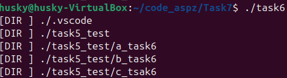

## Завдання 7
### Виконуючи це завдання, я спочатку переглядав кожен файл і перевіряв, чи не є він виконавчим (elf)?
### Згодом, якщо він виконавчий я перепитував у користувача, чи бажає він надати доступ для читання для всіх користувачів?
```
#include <stdio.h>
#include <dirent.h>
#include <stdlib.h>
#include <sys/stat.h>
#include <string.h>
#include <unistd.h>
#include <sys/types.h>
#include <fcntl.h>

int is_elf_file(const char *filename) {
    unsigned char buf[4];
    int fd = open(filename, O_RDONLY);
    if (fd == -1) return 0;

    if (read(fd, buf, 4) != 4) {
        close(fd);
        return 0;
    }
    close(fd);

    // ELF magic numbers: 0x7F 'E' 'L' 'F'
    return buf[0] == 0x7f && buf[1] == 'E' && buf[2] == 'L' && buf[3] == 'F';
}

int is_c_output_executable(const struct stat *st, const char *filename) {
    return S_ISREG(st->st_mode) &&
           (st->st_mode & S_IXUSR) &&
           is_elf_file(filename);
}

int main(void)
{
    DIR *dir;
    struct dirent *entry;
    struct stat st;
    char response[10];

    dir = opendir(".");
    if (!dir) {
        perror("opendir");
        return 1;
    }

    printf("Executable C programs:\n");
    while ((entry = readdir(dir)) != NULL) {
        if (stat(entry->d_name, &st) == -1)
            continue;

        if (is_c_output_executable(&st, entry->d_name)) {
            printf("Found: %s\n", entry->d_name);
            printf("Apply read permission to other users? (y/n): ");
            fgets(response, sizeof(response), stdin);

            if (response[0] == 'y' || response[0] == 'Y') {
                mode_t new_mode = st.st_mode | S_IROTH;
                if (chmod(entry->d_name, new_mode) == -1) {
                    perror("chmod");
                } else {
                    printf("Read permission added to %s\n", entry->d_name);
                }
            }
        }
    }

    closedir(dir);
    return 0;
}
```
### Результат виконання:
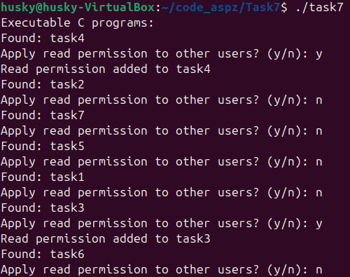

## Завдання 8
### Завданням було створити програму, яка перелічувала всі файли, які знаходяться в директорії та пропонувала би їх видалити (Принцип подібний до попереднього завдання):
```
#include <stdio.h>
#include <dirent.h>
#include <stdlib.h>
#include <sys/stat.h>
#include <string.h>
#include <unistd.h>
#include <sys/types.h>

int is_regular_file(const struct stat *st) {
    return S_ISREG(st->st_mode);
}

int main(void)
{
    DIR *dir;
    struct dirent *entry;
    struct stat st;
    char response[10];

    dir = opendir(".");
    if (!dir) {
        perror("opendir");
        return 1;
    }

    printf("All regular files in this directory:\n");

    while ((entry = readdir(dir)) != NULL) {
        if (stat(entry->d_name, &st) == -1)
            continue;

        if (is_regular_file(&st)) {
            printf("Found: %s\n", entry->d_name);
            printf("Do you want to delete this file? (y/n): ");
            fgets(response, sizeof(response), stdin);

            if (response[0] == 'y' || response[0] == 'Y') {
                if (remove(entry->d_name) == 0) {
                    printf("Deleted: %s\n", entry->d_name);
                } else {
                    perror("delete failed");
                }
            }
        }
    }

    closedir(dir);
    return 0;
}
```
### Наочний приклад:
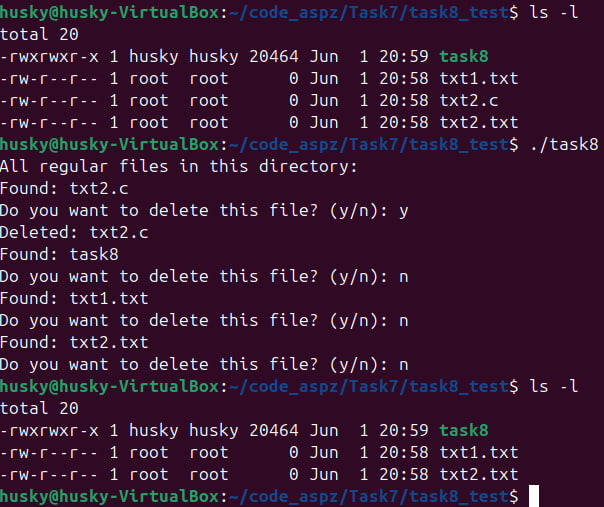 

## Завдання 9
### Для цього завдання зробимо простеньку програму, яка просто заміряє системний час до цього (помноживши звичайний час в секундах від початку UNIX ери на 1000 та додавши до нього отриманий час в мікросекундах поділений на 1000, аби перевести в мілі- для точності розрахунків), та після і вимірює різницю вже підготованого, форматованого часу:
```
#include <stdio.h> // for i/o
#include <stdlib.h> // for
#include <sys/time.h> // using in 

long get_time_miliseconds(){
    struct timeval time;
    gettimeofday(&time, NULL);
    return (long)(time.tv_sec * 1000 + time.tv_usec / 1000);
}

int main(int argc, char const *argv[])
{
    long start_time, end_time;
    start_time = get_time_miliseconds();

    // --- executable code block starts ---

    volatile int dummy = 0;
    for(int i = 0; i < 1000000; i++){
        dummy += i % 10;
        dummy *= dummy;
        dummy += 21;
    }

    // --- executable code block ends ---

    end_time = get_time_miliseconds();
    printf("Execute time: %ld (milliseconds)\n", (end_time - start_time));
    return 0;
}
```
### Після НЕЙМОВІРНОГО навантаження отримуємо час відгуку в 1 мілісекунду:
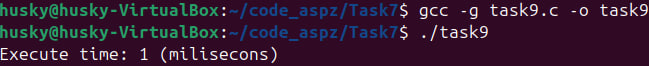

## Завдання 10
### Створимо просту псевдовипадкову генерацію чисел за допомогою сіду у вигляді системного часу (Вибірку від 0 до 1 ми отримуємо за рахунок того, що переводимо rand() у double, а потім ділимо його на максимально можливе число генерації MAX_RAND)
### Для значення від 0 до n, просто домножуємо вихід з першої функції
```
#include <stdio.h>
#include <stdlib.h>
#include <time.h>

double rand_float_0_1(){
    return (double)rand() / RAND_MAX;
}

double rand_float_0_n(int n){
    return rand_float_0_1() * n;
}

int main(int argc, char const *argv[])
{
    int count;
    double n;

    srand(time(NULL));

    printf("Enter how many itterations of rand[0.0; 1] you want: ");
    scanf("%d", &count);

    printf("rand[0.0; 1] nums generation:\n");
    for (size_t i = 0; i < count; i++)
    {
        printf("%f\n", rand_float_0_1());
    }


    printf("\nEnter upper line to generate rand[0.0; n] nums: ");
    scanf("%lf", &n);

    printf("rand[0.0; %.2f] nums generation:", n);
    for (size_t i = 0; i < count; i++)
    {
        printf("%f\n", rand_float_0_n(n));
    }

    return 0;
}
```
### Результат:
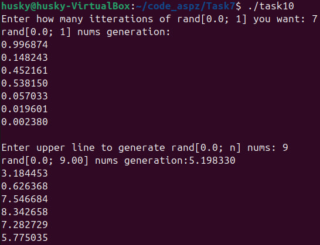

## Завдання 11 (12 варіант)
### Моїм завданням було створити програму, яка буде логувати запуск, не використовуючи жодного лог-файлу
### Реалізував це я за допомогою бібліотек з доступом до системного журналу, куди він і записується за шляхом **/var/log/syslog**
```
#include <stdio.h> // for i/o
#include <stdlib.h>
#include <string.h>
#include <syslog.h> // for working with system logs
#include <unistd.h> // for getpid()
#include <time.h>   // for time in logging

int main(int argc, char const *argv[])
{
    // Use access to system journal logging
    openlog("ProgramLogger", LOG_PID | LOG_CONS, LOG_USER); 
    // program`s name, add PID to process and duplicate in console if an error occurs, 
    // standard user logging channel

    time_t now = time(NULL); // get time
    char* time_formate = ctime(&now); // create comfortable time format

    if(time_formate){
        time_formate[strcspn(time_formate, "\n")] = '\0';
        // delete '\n' in the end and change it for '\0'
    }

    syslog(LOG_INFO, "\nProgram was started at %s (PID: %d)", time_formate, getpid()); 
    // LOG_INFO - level of logging importance

    closelog(); // close logging
    printf("The program has been started. The log has been written to the system log\n");

    return 0;
}
```
### Запуск програми та перегляд логів:
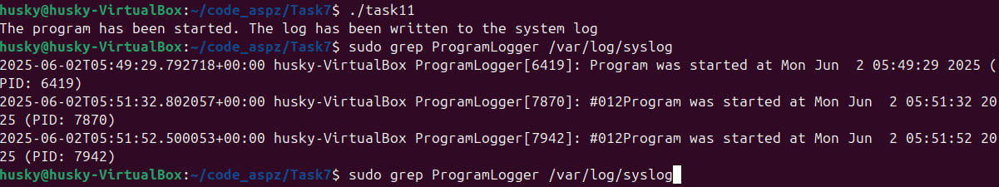
### Як бачимо, з кожним запуском програми додається один запис логів.